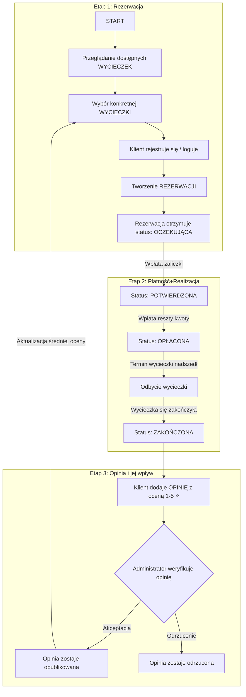

# 📊 Diagram Relacji - Biuro Podróży

## Struktura bazy danych

```
┌─────────────────────┐
│       KRAJ          │
├─────────────────────┤
│ • nazwa (unique)    │
│ • kod (unique)      │
│ • kontynent         │
│ • opis              │
└──────┬──────────────┘
       │
       │ 1:M
       ├───────────────────────────────────────┐
       │                                       │
       ↓                                       ↓
┌─────────────────┐                   ┌──────────────────┐
│ LINIA LOTNICZA  │                   │     HOTEL        │
├─────────────────┤                   ├──────────────────┤
│ • nazwa         │                   │ • nazwa          │
│ • kod_iata      │ 1:M               │ • miasto         │
│ • kraj ────────→│────┐              │ • adres          │
│ • strona_www    │    │              │ • kategoria ⭐   │
└─────────────────┘    │              │ • opis           │
                       ↓              │ • udogodnienia   │
                ┌──────────────┐      │ • strona_www     │
                │     LOT       │     │ • kraj ─────────→│
                ├──────────────┤      └────┬─────────────┘
                │ • numer_lotu │           │
                │ • linia ─────│           │ 1:M
                │ • lotnisko_↑ │           │
                │ • lotnisko_↓ │           │
                │ • data_↑     │           │
                │ • data_↓     │           │
                │ • czas_∆     │           │
                └──────┬───────┘           │
                       │                   |
                       │ 1:M               │
                       ├───────────────────┘
                       ↓
              ┌──────────────────────────────┐
              │        WYCIECZKA             │
              ├──────────────────────────────┤
              │ • nazwa                      │
              │ • opis                       │
              │ • kraj_docelowy ────────────→│
              │ • hotel ────────────────────→│
              │ • lot_tam ──────────────────→│
              │ • lot_powrot ───────────────→│
              │ • data_rozpoczecia           │
              │ • data_zakonczenia           │
              │ • liczba_dni / nocy          │
              │ • opcja_cenowa (S/P/L)       │
              │ • cena_za_osobe              │
              │ • cena_dziecko               │
              │ • max_liczba_osob            │
              │ • aktywna (bool)             │
              │ • created_at / updated_at    │
              │ @property srednia_ocena      │
              └──────┬───────────────────────┘
                     │
                     │ 1:M
          ┌──────────┴───────────┐
          ↓                      ↓
┌───────────────────┐    ┌──────────────────────┐
│   REZERWACJA      │    │      OPINIA          │
├───────────────────┤    ├──────────────────────┤
│ • klient ────────→│    │ • wycieczka ────────→│
│ • wycieczka ─────→│    │ • klient ───────────→│
│ • status          │    │ • rezerwacja ───────→│
│   ├ OCZEKUJACA    │    │ • ocena (1-5) ⭐     │
│   ├ POTWIERDZONA  │    │ • tytul              │
│   ├ OPLACONA      │    │ • tresc              │
│   ├ ANULOWANA     │    │ • ocena_hotelu       │
│   └ ZAKONCZONA    │    │ • ocena_lotu         │
│ • liczba_dorosłych│    │ • ocena_obslugi      │
│ • liczba_dzieci   │    │ • data_dodania       │
│ • cena_calkowita  │    │ • zweryfikowana      │
│ • zaliczka        │    │ [unique: klient+     │
│ • pozostalo_$     │    │  wycieczka]          │
│ • data_rezerwacji │    └──────────────────────┘
│ • data_potwierdz. │            ↑
│ • data_oplaty     │            │ 1:1
│ • uwagi           │            │
└───────┬───────────┘            │
        ↑                        │
        │                        │
        │ M:1                    │
        │                        │
┌───────┴────────────────────────┐
│      KLIENT                    |
├────────────────────────────────|
│ • user (OneToOne → User)       |
│ • imie                         |
│ • nazwisko                     |
│ • email (unique)               |
│ • telefon                      |
│ • adres                        |
│ • kod_pocztowy                 |
│ • miasto                       |
│ • kraj ───────────────────────→| (KRAJ)
│ • data_rejestracji             |
└────────────────────────────────┘


══════════════════════════════════════════════════════════════

LEGENDA:
───────→  Foreign Key (Many-to-One)
   1:M    Relacja One-to-Many
   1:1    Relacja One-to-One
   ⭐     System ocen 1-5 gwiazdek
   $      Automatyczne obliczenia
   S/P/L  Standard/Premium/Luxury

══════════════════════════════════════════════════════════════

KLUCZOWE RELACJE:

1. KRAJ jest centralnym węzłem dla:
   - Hoteli (kraj → hotele)
   - Wycieczek (kraj_docelowy → wycieczki)
   - Klientów (kraj → klienci)
   - Linii lotniczych (kraj_pochodzenia → linie_lotnicze)

2. WYCIECZKA łączy wszystkie elementy:
   - Hotel (gdzie mieszkamy)
   - Lot tam i powrót (jak lecimy)
   - Kraj docelowy (gdzie jedziemy)
   - Rezerwacje (kto jedzie)
   - Opinie (co myślą o wycieczce)

3. REZERWACJA jest punktem transakcyjnym:
   - Łączy klienta z wycieczką
   - Śledzi status płatności
   - Automatycznie oblicza pozostałą kwotę

4. OPINIA umożliwia feedback:
   - Jeden klient = jedna opinia na wycieczkę (unique_together)
   - System ocen 1-5 ⭐
   - Opcjonalne szczegółowe oceny (hotel/lot/obsługa)

══════════════════════════════════════════════════════════════
```

## Przepływ danych - Przykład rezerwacji


